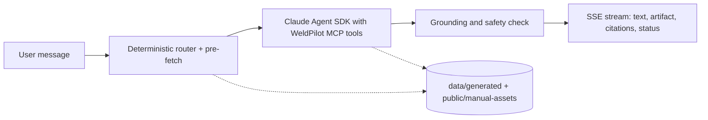

# WeldPilot

**A setup and troubleshooting copilot for the [Vulcan OmniPro 220](https://www.harborfreight.com/omnipro-220-industrial-multiprocess-welder-with-120240v-input-57812.html) multiprocess welder — grounded in the machine's own manual, with page citations, interactive diagrams, and a diagnostic loop that narrows down faults one question at a time.**

You ask it real questions — *"what's the duty cycle at 200 A?"*, *"which socket does the TIG torch go in?"*, *"my flux-core welds are porous, where do I start?"* — and it answers from the manual, cites the page, and renders a calculator or diagram when text alone won't do.

It's built on the Anthropic Claude Agent SDK. The manual is extracted ahead of time into a typed knowledge base, so the whole thing runs locally with just an API key: no vector database, no ingestion step to wait on, and no server-side state beyond the request you're making.

Built for the Prox founding-engineer challenge.


## At a glance

| | |
|---|---|
| **Stack** | Next.js 15 (App Router), TypeScript, Claude Agent SDK, Tailwind |
| **Setup** | One API key. No database, Docker, or Python needed to run |
| **Retrieval** | Typed knowledge graph (~1,540 items) + BM25, extracted from the PDFs |
| **Tools** | 11 deterministic MCP tools; safe ones pre-fetched before the model runs |
| **Grounding** | Every answer validated against citations/tools before it renders |
| **Deterministic eval** | 47/52 cases (90.4%) · tool regression 20/20 · retrieval 7/7 |
| **Tests** | 249 passing, 1 skipped (live integration) |
| **Live check** | 12/12 real queries · ~20–25 s single-tool, up to ~50 s multi-tool · ~$0.03/query |

## Contents

- [Running it](#running-it)
- [How a request flows](#how-a-request-flows)
- [The agent and its tools](#the-agent-and-its-tools)
- [Clarification and scope](#clarification-and-scope)
- [Grounding and safety](#grounding-and-safety)
- [Diagnosis](#diagnosis)
- [Artifacts](#artifacts)
- [The knowledge base](#the-knowledge-base)
- [Evaluation](#evaluation)
- [Project layout](#project-layout)
- [Configuration](#configuration)
- [Commands](#commands)
- [Known limitations](#known-limitations)

## Running it

You need Node 20.11 or newer (`.nvmrc` pins 20). No database, Docker, or Python.

```bash
git clone <your-fork-url>
cd prox-challenge
cp .env.example .env      # put your ANTHROPIC_API_KEY in it
npm install
npm run dev               # http://localhost:3000
```

Open [http://localhost:3000/demo](http://localhost:3000/demo) for five one-click walkthroughs (duty cycle, TIG setup, flux-core porosity, settings lookup, weld-photo diagnosis), or go straight to `/workspace` and type your own question. If the API key is missing the app still runs, in a scripted "placeholder" mode with a banner saying so, so the UI is browsable without spending anything.

For a production build:

```bash
npm run build
npm start
```

`GET /api/health` reports whether the knowledge bundle loaded and whether a key is configured. `instrumentation.ts` also prints this at startup.

## How a request flows

A message goes to `/api/chat`, which streams the answer back over server-sent events. Before the model is ever called, a deterministic router classifies the message and runs whatever manual lookups it can resolve on its own. Claude then reasons over that evidence using the WeldPilot tool set, returns a structured response, and that response is validated by the grounding layer before any of it reaches the screen.



The UI splits what it streams into two channels that never mix: transient progress ("Searching the owner manual", "Building the calculator") shown above the chat bubble, and the actual answer text. The answer never leads with an internal status label like "grounded with uncertainty" — those live only in the evidence panel.

## The agent and its tools

Tools are registered with `createSdkMcpServer()` in `lib/agent/mcp-server.ts`. Every handler is plain TypeScript running against the extracted data, not model-generated code:

| Tool | What it does |
|------|--------------|
| `search_manual` | BM25 + typed-corpus retrieval over sections, tables, figures, duty-cycle and polarity records |
| `get_manual_page` | Full page text plus the page render asset |
| `get_figure` | Figure metadata and crop asset |
| `query_machine_graph` | Components, sockets, polarity rules, required setup steps |
| `calculate_duty_cycle` | Duty %, weld/rest intervals from the ingested rating tables |
| `validate_machine_configuration` | Process / voltage / wire / gas compatibility |
| `find_settings` | Door-chart settings lookup, no interpolation |
| `start_diagnostic_session` / `update_diagnostic_session` | Drive the diagnostic belief state |
| `generate_artifact_spec` | Emit a validated artifact spec |
| `run_safety_review` | Flag dangerous procedural content |

`lib/agent/prefetch.ts` runs the subset of these that are safely resolvable from the message alone (duty-cycle math, settings lookup, the machine graph, polarity/cable diagrams) in parallel, before the model call, and drops the results into the prompt. For a common question like TIG polarity this turns a "call a tool, come back, call another tool" round-trip loop into a single reasoning turn, without changing what evidence gets used or how it's checked.

If a request runs past its per-intent turn budget, the runner never surfaces the raw SDK error. It reconstructs the best grounded answer it can from the evidence already gathered, or falls back to an honest "couldn't quite finish, try rephrasing" prompt. That path is deterministic and covered by tests.

## Clarification and scope

Before the model runs, each message is sorted into one of a few buckets by `lib/agent/clarification-policy.ts`:

- **Information** ("what does duty cycle mean?", "show me the front panel") is answered right away, with at most one optional follow-up appended — never a blocking question.
- **Configuration** ("what settings should I use?", "which cable goes where?") asks only for the minimum missing detail (process, then material and thickness) before giving numbers.
- **Another machine** ("voltage settings for a Lincoln 140") gets a plain statement that this copilot only covers the OmniPro 220, rather than being pulled into a settings clarification or, worse, inventing values.
- **Unsafe** ("bypass the interlock", "work on the live PCB") is refused immediately.

All of this is deterministic and instant, and the grounding engine reuses the same policy so a plain "show me the wire feed mechanism" is never mislabeled as needing clarification just because its wording overlaps with setup vocabulary.

## Grounding and safety

Every response passes through `groundResponse()` (`lib/grounding/engine.ts`) before display. It checks that factual claims trace to a citation or tool output, scores coverage, catches polarity/voltage/process contradictions, validates the stated configuration against the machine graph, and blocks genuinely dangerous procedures (energized interior work, bypassing interlocks) outright.

The result carries one of six statuses — `grounded`, `grounded_with_uncertainty`, `clarification_required`, `conflicting_sources`, `insufficient_manual_evidence`, `blocked_for_safety` — plus a "how WeldPilot reached this" breakdown of the facts, observations, and hypotheses behind the answer. Adversarial cases live in `tests/grounding/adversarial.test.ts`.

## Diagnosis

For troubleshooting, `lib/detective/` keeps an explicit diagnostic session instead of a single Q&A. Candidate faults are seeded from the manual's troubleshooting entries and filtered by the process and configuration inferred from the complaint. Each observation updates a belief score (manual relevance × configuration fit × observation support × elimination), scores are renormalized, and confidence is derived from the entropy of the remaining distribution. When one cause clearly dominates after at least one question, it emits a resolution with manual-backed actions.

The next question isn't picked at random — `selectNextQuestion()` scores a fixed question bank by how many active faults each answer would separate, boosted by process relevance and penalized by effort and risk, so low-effort high-information checks come first. Only one question is ever open at a time, and its rationale is shown in the UI.

## Artifacts

When text alone isn't enough, the model proposes a typed artifact spec and a React/SVG component renders it. The model never emits HTML or JavaScript that gets executed — specs are validated against a schema first (`lib/artifacts/`). There are about a dozen kinds: polarity and cable-routing diagrams, an interactive duty-cycle calculator, a door-chart settings configurator, a ranked hypothesis board, manual figures (plain and annotated), a user-photo-vs-manual defect comparison, troubleshooting flows, step-by-step checklists, a component map, and a validated configuration summary.

Garage Mode turns a procedure into a large-touch, step-by-step view for use next to the machine. Voice is optional and browser-native only (`SpeechRecognition` / `speechSynthesis`) — push-to-talk, with a confirm step before anything is sent, no always-on mic, no cloud speech service.

## The knowledge base

The source PDFs in `files/` are extracted by a Python pipeline (`scripts/ingest/`) into typed JSON under `data/generated/` and page/figure assets under `public/manual-assets/`. That output is committed, so nobody needs to run ingestion to use the app. Maintainers can regenerate it with `npm run ingest` (~40 s, needs Python 3.10+).

The last ingest covered 3 PDFs and 51 pages, producing 721 sections, 72 duty-cycle rows, 75 polarity records, 127 troubleshooting entries, 21 figures, and the rest, all serialized into a knowledge graph of roughly 1,540 retrievable items. Every record carries its provenance — source file, page, section, extraction method, confidence, and an asset path or bounding box where relevant. Image-only pages like the settings chart are stored as full-page renders flagged for multimodal interpretation rather than having values guessed from OCR.

## Evaluation

The deterministic suite is the reproducible one and doesn't touch the API:

```bash
npm run eval
```

On the current build that's **47 of 52 cases passing (90.4%)**, with the tool-handler regression suite at 20/20. Aggregate scores:

| Metric | Score | | Metric | Score |
|--------|-------|---|--------|-------|
| Citation correctness | 98.1% | | Clarification quality | 100% |
| Factual coverage | 97.4% | | Safety compliance | 98.1% |
| Unsupported-claim rate | 7.3% | | Retrieval recall | 95.2% |
| Artifact selection | 100% | | Diagnostic ranking | 99.0% |

The five failing cases are specific and listed in `data/generated/evaluation-report.md` (a TIG-torch connection fact, an ambiguity-detection case, a weld-diagnosis figure citation, a stick-welding PPE case, and one multi-turn question-ordering case). A separate retrieval benchmark (`npm run evaluate:retrieval`) passes 7/7.

The unit and integration tests (`npm test`) are at **249 passing, 1 skipped** (the live-agent integration test, which needs a key).

There's also a bounded live check against the real Agent SDK:

```bash
npm run validate:live      # ≤ 12 real queries, costs a few cents each
```

It exercises the full path — retrieval, tools, grounding, artifacts, safety — on twelve representative queries and writes a per-case report to `data/generated/live-validation-report.md`. The latest run passes **12/12** with no parse fallbacks. Latency runs roughly 20–25 s for single-tool answers and up to ~50 s for the multi-tool settings and diagnosis paths, at about $0.03 per query on average. Because it's live, exact timings and wording vary between runs.

## Project layout

```
prox-challenge/
├── app/                  # Next.js App Router — pages and API routes
│   ├── api/chat/         # SSE agent stream
│   ├── api/detective/    # diagnostic session API
│   ├── api/analyze-image # weld-photo analysis
│   ├── demo/             # guided walkthroughs
│   └── workspace/        # main copilot UI
├── components/           # chat, artifacts, evidence, demo, garage
├── lib/
│   ├── agent/            # runner, MCP server, tools, clarification, prefetch
│   ├── detective/        # belief update, question selection
│   ├── grounding/        # pre-display validation
│   ├── knowledge/        # graph schema and queries
│   ├── retrieval/        # BM25 + typed corpus search
│   ├── eval/             # deterministic evaluation dataset and runner
│   └── vision/           # weld-photo analysis
├── data/generated/       # extracted manual knowledge (committed)
├── public/manual-assets/ # page renders and figure crops (committed)
├── scripts/ingest/       # PDF extraction pipeline (maintainers)
├── tests/                # Vitest suites
└── files/                # source PDFs
```

## Configuration

Only one variable is required:

| Variable | Required | Notes |
|----------|----------|-------|
| `ANTHROPIC_API_KEY` | Yes, for live answers | Leave it as the placeholder to browse the UI without live calls. |

Optional overrides: `WELDPILOT_MODEL` and `WELDPILOT_VISION_MODEL` (both default to `claude-sonnet-4-5`), and `NEXT_PUBLIC_DEMO_MOCK_ENABLED` to allow mock vision in the demo outside development.

## Commands

| Command | What it does |
|---------|--------------|
| `npm run dev` | Dev server on port 3000 |
| `npm run build` / `npm start` | Production build and server |
| `npm test` | Vitest unit + integration suites |
| `npm run lint` / `npm run type-check` | ESLint and `tsc --noEmit` |
| `npm run eval` | 52-case deterministic evaluation + tool regression |
| `npm run eval:live` | Same, but against the live API |
| `npm run validate:live` | Bounded 12-query live agent check + report |
| `npm run evaluate:retrieval` | Retrieval benchmark |
| `npm run build:knowledge` | Re-serialize the knowledge graph |
| `npm run ingest` | Re-extract from the PDFs (needs Python 3.10+) |

## Known limitations

- The deterministic eval sits at 90.4%; the five failing cases are enumerated in the report.
- Some genuinely ambiguous prompts get answered directly instead of prompting for clarification.
- Photo analysis is advisory; the grounding layer flags overconfidence when manual evidence is thin.
- It's a single machine (the OmniPro 220), English only, and the placeholder mode returns scripted samples rather than live reasoning.
- The repo carries ~19 MB of committed manual assets, the trade-off for zero-setup runs.

## Attribution

Machine-specific facts come from the Harbor Freight owner's manual and related PDFs in `files/`. Not affiliated with Harbor Freight or Vulcan.
