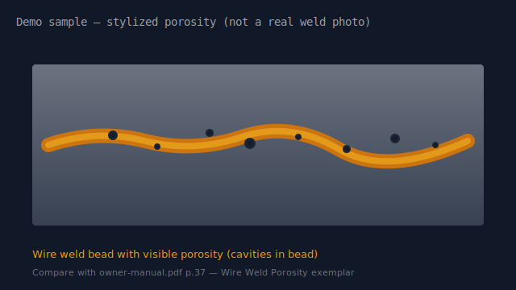
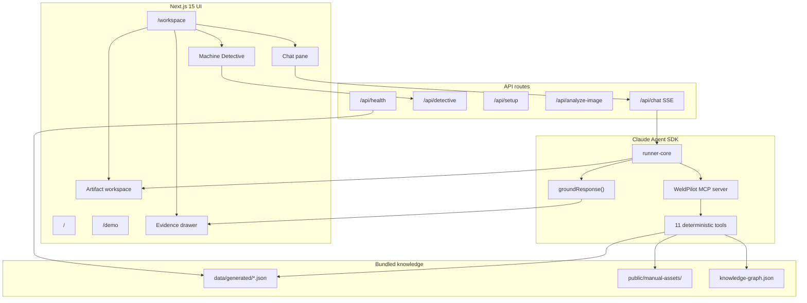

# WeldPilot — Prox Founding Engineer Challenge

**WeldPilot** is a multimodal diagnostic and setup copilot for the [Vulcan OmniPro 220](https://www.harborfreight.com/omnipro-220-industrial-multiprocess-welder-with-120240v-input-57812.html) (Harbor Freight item 57812). It answers deep technical questions with **page-level manual citations**, **interactive artifacts**, and a **structured diagnostic engine** — not a generic chat wrapper over PDF text.

> **One sentence:** WeldPilot turns a 48-page welding manual into executable machine knowledge, then reasons over it with the Claude Agent SDK, typed multimodal artifacts, and a belief-update diagnostic loop grounded in source evidence.

---

## Challenge context

The Prox challenge asks for a multimodal reasoning agent built on the **Anthropic Claude Agent SDK** that can:

- Answer cross-referenced technical questions (duty cycle, polarity, troubleshooting)
- Surface manual diagrams, charts, and weld-diagnosis photos with provenance
- Generate interactive content (calculators, flowcharts, configurators) when text alone is insufficient
- Run locally with a single API key

Source PDFs live in `files/`. Our solution **pre-bundles** extracted knowledge so judges can run the app in under two minutes without ingestion.

Reference product video (challenge prompt): https://www.youtube.com/watch?v=kxGDoGcnhBw

---

## Screenshots

| Product | Manual evidence | Visual diagnosis demo |
|---------|-----------------|----------------------|
|  |  |  |
| Exterior | `owner-manual.pdf` p.37 — porosity exemplar | Demo upload used in `/demo/visual-diagnosis` |


> **Demo GIF:** Not bundled in-repo (keeps clone size small). Judges: run `npm run dev` → open `/demo` for the five guided scenarios (Duty Cycle → TIG Setup → Flux Porosity → Settings → Visual Diagnosis). Use **Reset Demo** between scenarios if needed.

---

## Hosted demo

**Live URL:** Local-first submission — run `npm run dev` and open [http://localhost:3000/demo](http://localhost:3000/demo). No separate hosted deployment is required for judging.

**Health check:** `GET /api/health` returns knowledge-bundle status and API-key configuration
(JSON). A human-readable version lives at the developer route `/dev/health` — it is intentionally
not linked from the primary landing page, which is judge/product-facing.

---

## Video walkthrough

**Walkthrough:** Optional for judges — the in-app `/demo` hub is the primary 5-minute path. Suggested order: Duty Cycle → TIG Setup → Flux Porosity (Machine Detective) → Settings Configurator → Visual Diagnosis.

---

## Key features

| Feature | What it does |
|---------|----------------|
| **Four workspace modes** | Setup, Diagnose, Settings, Manual — each with mode-specific tools and UI |
| **Claude Agent SDK + MCP tools** | 11 deterministic tools over ingested manual + knowledge graph |
| **Typed artifact workspace** | 13 `ArtifactSpec` types rendered as React/SVG — no model-generated HTML |
| **Machine Detective** | Belief-update diagnostic session with ranked hypotheses and ruled-out causes |
| **Information-gain questioning** | One clarification at a time, scored by fault separation and effort |
| **Grounding layer** | Pre-display validation: citations, safety, conflicts, coverage score |
| **Weld photo analysis** | Vision path with manual exemplar comparison artifact |
| **Garage Mode** | Large-touch procedures; optional browser push-to-talk (confirm before send) + spoken steps |
| **Judge demo route** | Five one-click scenarios at `/demo` (~4.5 min total) |
| **Evaluation suite** | 52 deterministic cases (47 pass, 90.4%) + 20 tool regressions (`npm run eval`) |
| **Zero-ingest judge setup** | Bundled `data/generated/` + `public/manual-assets/` committed |

---

## Five demo scenarios

Run from **http://localhost:3000/demo** after `npm run dev`.

| # | ID | Mode | Prompt (summary) | ~Duration |
|---|-----|------|------------------|-----------|
| 1 | `duty-cycle` | Manual | MIG duty cycle at 200 A on 240 V | 45 s |
| 2 | `tig-setup` | Setup | TIG polarity and ground-clamp socket | 45 s |
| 3 | `flux-porosity` | Diagnose | Flux-core porosity troubleshooting | 60 s |
| 4 | `settings-configurator` | Settings | 1/8″ mild steel MIG on 240 V | 45 s |
| 5 | `visual-diagnosis` | Diagnose | Upload weld photo vs manual p.37 | 60 s |

Each scenario uses the real agent path (or dev-only mock vision toggle when `NEXT_PUBLIC_DEMO_MOCK_ENABLED=true`).

---

## Architecture



**Request path:** User message → `/api/chat` → Claude Agent SDK `query()` with WeldPilot MCP tools → structured `AgentResponse` → grounding validation → SSE stream (text, artifact, citations, grounding, state) → UI.

---

## Agent tool architecture

Tools are registered in `lib/agent/mcp-server.ts` via `createSdkMcpServer()` and invoked by the agent — handlers are **deterministic TypeScript**, not LLM-generated.

| Tool | Purpose |
|------|---------|
| `search_manual` | Hybrid BM25 + typed corpus retrieval (sections, tables, figures, duty cycle, polarity, …) |
| `get_manual_page` | Full page text + render asset path |
| `get_figure` | Figure metadata and crop asset |
| `query_machine_graph` | Components, ports, polarity rules, required setup |
| `calculate_duty_cycle` | Duty %, work/cool intervals from ingested tables |
| `validate_machine_configuration` | Process/voltage/wire/gas compatibility checks |
| `find_settings` | Door-chart settings lookup (no interpolation) |
| `start_diagnostic_session` | Initialize Machine Detective session |
| `update_diagnostic_session` | Apply observation / answer to beliefs |
| `generate_artifact_spec` | Emit validated `ArtifactSpec` JSON |
| `run_safety_review` | Flag dangerous procedural content |

Tool regression: **20/20** handler cases pass (`npm run eval`).

### Deterministic pre-fetch (before the model is called)

`lib/agent/prefetch.ts` runs the subset of the tools above that are safely resolvable from the
message/machine state alone — deterministically, in parallel, and *before* the Claude Agent SDK
query starts. Depending on intent this covers `search_manual`, `calculate_duty_cycle`,
`find_settings`, `query_machine_graph` (required setup steps for a known process), and — for
polarity/socket/cable questions — the manual-cited **polarity + cable-routing diagrams** built
straight from documented polarity data. Pre-registering those diagrams is what lets a TIG setup
question resolve in 2–3 turns (~25 s) instead of spending extra turns on `get_figure` /
`generate_artifact_spec` (~55 s before). This turns the common request shape from
`Claude → tool → Claude → tool → Claude → ... → StructuredOutput` into
`deterministic router → parallel pre-fetch → one Claude reasoning turn → deterministic artifact
render → response`, without changing what evidence is used or how grounding/safety evaluate it
— see "Live Claude agent validation" below for measured before/after impact.

---

## Manual ingestion pipeline

**Judges do not run ingestion.** Maintainers can reproduce bundled data from `files/*.pdf`:

```bash
npm run ingest    # ~40 s — requires Python 3.10+
```

Pipeline (`scripts/ingest/pipeline.py`):

1. **PyMuPDF** — text blocks, bounding boxes, embedded images, full-page PNG renders
2. **pdfplumber** — table extraction
3. **Dedup + enrich** — sections, duty-cycle rows, entities, relationships
4. **Validate** — `validation-report.json` with errors/warnings
5. **Write** — `data/generated/*.json` and `public/manual-assets/`

Cross-platform entry: `tsx scripts/ingest/index.ts` (Node wrapper; bash alternative: `scripts/ingest/run.sh`).

Last ingest manifest (`data/generated/manifest.json`): **51 pages**, 721 sections, 72 duty-cycle rows, 3 source PDFs, **39.6 s** elapsed.

---

## Machine knowledge representation

Ingestion produces a **typed knowledge graph** (`knowledge-graph.json`, 1,540 retrievable items):

| Corpus type | Count | Example use |
|-------------|-------|-------------|
| `text_section` | 681 | Q&A, procedural text |
| `graph_relationship` | 582 | Component ↔ port ↔ process links |
| `duty_cycle` | 72 | Rated amps / duty % by process and voltage |
| `polarity` | 56 | Socket assignments per process |
| `troubleshooting` | 40 | Fault → cause → remedy |
| `figure` | 21 | Diagrams with asset paths |
| `table` | 50 | Spec tables |
| `warning` | 37 | Safety callouts |

Each record carries **provenance**: `source`, `page`, `section`, `extractionMethod`, `confidence`, optional `assetPath` / `bbox`.

Static renders: **205 files** in `public/manual-assets/` (page PNGs, figure crops, JPEG embeds). Image-only pages (e.g. selection chart) are stored as full-page renders flagged `needsMultimodalInterpretation` — values are never guessed from OCR alone.

---

## Diagnostic belief-update approach

**Machine Detective** (`lib/detective/`) maintains an explicit `DiagnosticSession`:

1. **Candidate generation** — faults seeded from manual troubleshooting entries, filtered by process/config inferred from the complaint
2. **Belief update** (`updateBeliefs`) — multiplicative scoring: manual relevance × config compatibility × observation support/contradict × elimination
3. **Normalization** — scores renormalized across active faults
4. **Uncertainty** — Shannon entropy over active fault distribution → `diagnosticConfidence = 1 − uncertainty`
5. **Resolution** — when one cause dominates (>55% score, ≤1 plausible cause) after ≥1 question, emit `finalResolution` with manual-backed actions

This runs **deterministically** in `/api/detective` and mirrors into hypothesis-board artifacts for the UI.

---

## Information-gain question selection

`selectNextQuestion()` (`lib/detective/questions.ts`) scores each question in a fixed bank:

```
score = 0.55 × (separating_faults / active_faults)
      + relevanceBoost(context)
      + 0.20
      − effortPenalty
      − safetyPenalty
```

- **Separation** — count of active faults the answer would distinguish (e.g. gas vs non-gas causes after wire-type answer)
- **Relevance boost** — process-specific (e.g. `wire_type` +0.35 for flux complaints)
- **Effort / safety penalties** — prefer low-effort, low-risk checks first
- **Gating** — skip gas-flow questions for self-shielded flux; require ≥2 separable faults except high-value disambiguators

Only **one question** is active at a time. Rationale is shown in the detective panel and grounding “How WeldPilot reached this” panel.

---

## Multimodal artifact system

Artifacts are **typed, validated `ArtifactSpec` objects** — the model proposes specs; React components render them.

| Type | Example |
|------|---------|
| `polarity-diagram` | Socket polarity for MIG/TIG/flux/stick |
| `cable-routing-diagram` | Ground clamp → positive socket routing |
| `duty-cycle-calculator` | Interactive work/cool timeline |
| `settings-configurator` | Door-chart settings (documented values only) |
| `diagnostic-hypothesis-board` | Ranked causes with confidence bars |
| `manual-figure` / `annotated-manual-figure` | Page render + region callouts |
| `weld-defect-comparison` | User photo vs manual exemplar |
| `troubleshooting-flow` | Branching fault tree |
| `step-by-step-checklist` | Setup / Garage Mode procedures |
| `configuration-summary` | Validated machine config card |

Registry: `lib/artifacts/registry.ts`. Renderer: `components/artifacts/ArtifactRenderer.tsx`. **No arbitrary HTML/JS** from the model is executed.

---

## Garage Mode voice

Garage Mode (`/workspace` or a demo scenario → enter Garage Mode) is a large-touch procedure UI. Voice is **optional** and uses **browser-native** APIs only — no MediaRecorder, getUserMedia, Whisper, or cloud speech services.

| Behavior | Detail |
|----------|--------|
| **Push-to-talk** | Tap **Talk** to start `SpeechRecognition`; tap **Stop** to end early. Not always-listening. |
| **Confirm before send** | After recognition: **Heard: "…"** with **Send** / **Retry** / **Cancel**. Nothing reaches the agent until Send. |
| **Same chat pipeline** | Confirmed text goes through `sendMessage` (safety, retrieval, grounding, detective, artifacts unchanged). |
| **Spoken steps** | Existing procedure step-change TTS (`speechSynthesis`) speaks the current step; Repeat re-speaks. Listening cancels active TTS first. |
| **Browser support** | Chromium (Chrome/Edge) typically supports recognition + synthesis. Unsupported browsers show *Voice input is not supported in this browser.* and keep on-screen controls. |
| **Not a voice assistant** | No continuous listening, no wake word, no background mic. |

Implementation: `lib/garage/useGarageVoice.ts`, `lib/garage/voice-transcript.ts`, `components/garage/GarageModeView.tsx`.

---

## Safety and grounding design

Every assistant response passes `groundResponse()` (`lib/grounding/engine.ts`) before display:

| Check | Action |
|-------|--------|
| Citation presence for factual claims | Coverage score + unsupported-claim count |
| Numeric claims vs manual/tool output | Direct / calculated / unsupported levels |
| Process/voltage/polarity conflicts | `conflicting_sources` status |
| Dangerous procedures (energized work, bypassing interlocks) | `blocked_for_safety` — response withheld |
| Visual overconfidence | Warn when vision claims lack manual backing |
| Configuration validation | Graph-based compatibility via ingested rules |

**Grounding statuses:** `grounded`, `grounded_with_uncertainty`, `clarification_required`, `conflicting_sources`, `insufficient_manual_evidence`, `blocked_for_safety`.

UI: `GroundingBanner`, `HowReachedPanel` in evidence drawer; status strip shows active safety warnings.

Adversarial tests: `tests/grounding/adversarial.test.ts` (8 cases).

---

## Clarification policy

WeldPilot never shows an internal state label (e.g. "Clarification required") next to a full
answer — that contradictory pattern is exactly what `lib/agent/clarification-policy.ts` removes.
Every incoming message is deterministically classified into one of three levels before the model
is ever called:

| Level | Examples | Behavior |
|-------|----------|----------|
| **Information** | "Show me the front panel", "What does the duty cycle mean?" | Answered immediately (manual image/diagram surfaced); at most one polite, non-blocking follow-up appended to the answer — never blocks. |
| **Configuration** | "What settings should I use?", "Which cable goes where?", "Configure MIG" | Asks for only the minimum missing detail (process, then material/thickness) in plain conversational language — no recommendation is generated until that's known. Deterministic and instant (no model call). |
| **Safety-critical** | "Bypass safety", "Live electrical work" | Blocked immediately with a clear refusal — deterministic and instant. |

Key functions: `clarificationLevel()`, `requiredMissingFields()`, `shouldRequireClarification()`,
`optionalFollowUp()`. `lib/agent/runner-core.ts` uses these to short-circuit configuration/safety
requests before the model runs, and `lib/grounding/engine.ts` delegates its own missing-parameter
check to the same policy so a pure information request (e.g. "show me the wire feed mechanism")
is never mislabeled as needing clarification just because its wording overlaps with setup
vocabulary.

Tests: `tests/agent/clarification-policy.test.ts` (front panel, wiring diagram, wire feed
mechanism, polarity, settings, duty cycle, ambiguous cable routing, safety request).

---

## Presentation: progress vs. answer

Execution progress and the user-facing answer are two different concerns, streamed as two
different `StreamEvent` types so they can never be mixed:

- **`progress`** — transient status steps (e.g. "Searching the owner manual", "Found the
  duty-cycle table and setup guide.", "Preparing your answer", "Building interactive
  calculator"). Rendered by `ProgressStatus` in a dedicated component above the chat bubble.
  Never persisted into the assistant message, never sent to the model, and not part of any
  saved conversation state — purely a live UI signal (`lib/agent/progress.ts`,
  `lib/agent/runner-core.ts`).
- **`text_delta`** — the actual answer. It starts directly with the answer (direct
  answer → brief context → next action / artifact mention → safety reminder only if relevant)
  and never begins with an internal label like "Grounded with uncertainty" or "Clarification
  required" — those are system states, not user prose, and live only in the Grounding &
  Evidence panel (`GroundingBanner`), driven by the separate `grounding` stream event.

The chat panel fades the progress component out the moment the first character of the real
answer arrives (`components/chat/MessageList.tsx`); progress and answer text are never shown
stacked in the same message. The artifact workspace heading tracks the same progress signal to
show a type-specific loading label (e.g. "Preparing interactive calculator…", "Preparing
diagram…") instead of a generic "BUILDING ARTIFACT..." placeholder.

Tests: `tests/agent/progress.test.ts`, `tests/agent/runner.test.ts` ("keeps execution progress
out of the assistant message text").

---

## Evaluation methodology and results

**Command:** `npm run eval` (deterministic mode — no live API calls)

| Metric | Measured value |
|--------|----------------|
| **Cases** | 52 total — **47 passed** (90.4%) |
| **Average case score** | 97.6% |
| **Tool regression** | **20/20 passed** |
| Citation correctness | 98.1% |
| Factual coverage | 97.4% |
| Unsupported claim rate | 7.3% |
| Correct artifact selection | 100.0% |
| Clarification quality | 100.0% |
| Safety compliance | 98.1% |
| Retrieval recall | 95.2% |
| Diagnostic ranking quality | 99.0% |
| Response latency | N/A (deterministic) |
| API cost | N/A (deterministic) |

**Strong categories (100% pass):** duty cycle, troubleshooting, polarity, technical factual, cross-page reasoning, wire feed, out-of-scope, settings.

**Weaker categories (one failing case each):** machine setup (3/4), ambiguous (3/4), visual content (2/3), unsafe-request handling (3/4), multi-turn diagnosis (3/4) — see `data/generated/evaluation-report.md` for per-case failures.

**Retrieval benchmark** (`npm run evaluate:retrieval`): **7/7** challenge-style queries passed; corpus **1,540** items.

**Unit/integration tests** (`npm test`): **232 passed**, 1 skipped (live agent integration).

Reports: `data/generated/evaluation-report.json`, `data/generated/retrieval-evaluation-report.json`.

### Live Claude agent validation (measured)

**Command:** `npm run validate:live` (≤12 live Agent SDK queries; report: `data/generated/live-validation-report.md`; before/after: `data/generated/latency-optimization-report.md`)

| Metric | Before orchestration optimization | After |
|--------|-----------------------------------|-------|
| **Live cases** | **12/12 passed** (100%) | **12/12 passed** (100%) |
| Avg / median / p90 latency | 32.3 s / 33.1 s / 52.2 s | **26.8 s / 24.5 s / 41.3 s** |
| Max end-to-end latency | 52.7 s | 54.3 s (one case still triggers extra model turns — see optimization report) |
| Avg time to first SDK token | ~5.7 s | ~9.6 s (heavier single reasoning turn — see note below) |
| Avg Claude model invocations / query | 8.0 | **4.6** (−43%) |
| Avg MCP tool calls / query | 3.75 | **1.9** (−49%) |
| Uncached / cache-create / cache-read tokens | 422 / 54,980 / 281,249 | 260 / 44,490 / 133,905 |
| Effective prompt tokens (sum of above) | 336,651 | **178,655** (−47%) |
| Output tokens | 19,591 | 16,151 |
| SDK `total_cost_usd` (12 cases) | ~$0.59 (~$0.049 / query) | **~$0.47** (~$0.039 / query, −21%) |
| Tool-using runs | 11/12 | 10/12 (fewer round trips needed — evidence now arrives pre-fetched) |
| Structured parse OK (no fallback) | 12/12 | 12/12 |
| Valid ArtifactSpec when present | 12/12 | 12/12 |
| Unsafe interlock bypass | blocked (`blocked_for_safety`) | blocked (`blocked_for_safety`) |
| Out-of-scope Lincoln request | blocked (`blocked_for_safety`) | blocked (`blocked_for_safety`) |

**Token accounting note:** SDK `input_tokens` is uncached input only; cost already reflected cache create/read. Reports publish effective prompt tokens.

**Orchestration optimization (this pass):** `lib/agent/prefetch.ts` runs `search_manual` /
`calculate_duty_cycle` / `find_settings` deterministically **before** the model is invoked
(parallel, independent tasks via `Promise.all`), and embeds the compact results directly in
the prompt so the common case resolves in one Claude reasoning turn instead of
`Claude → tool → Claude → tool → ... → StructuredOutput`. No reasoning, grounding, or safety
logic changed. Avg time-to-first-SDK-token went up (a single, heavier reasoning turn takes
longer to produce a first token than a quick "call a tool" turn did), but user-perceived
latency improves because the UI shows a dedicated progress indicator ("Searching the owner
manual", "Found the duty-cycle table...") within milliseconds of the request and updates it
again right after pre-fetch resolves — both before the model is even called, and both rendered
in a separate status component, never interleaved into the chat answer itself (see
"Presentation: progress vs. answer" below). Full before/after breakdown, waterfall methodology,
and the two correctness bugs found and fixed while re-running validation:
`data/generated/latency-optimization-report.md`.

Observed: tools used before machine claims; citations include expected manual pages (e.g. duty cycle p.7, front panel p.8, wire tension p.17/42); unsupported settings declined without invented numbers; multi-turn flux porosity asked clarifying questions across two turns.

---

## Project structure

```
prox-challenge/
├── app/                    # Next.js App Router (pages + API)
│   ├── api/chat/           # SSE agent stream
│   ├── api/detective/      # Machine Detective API
│   ├── api/health/         # Health check (JSON)
│   ├── dev/health/         # Health check (human-readable, developer route)
│   ├── demo/               # Guided judge scenarios
│   └── workspace/          # Main copilot UI
├── components/             # Chat, artifacts, evidence, demo, garage
├── lib/
│   ├── agent/              # Claude Agent SDK runner, MCP, tools
│   ├── detective/          # Belief update, questions, candidates
│   ├── grounding/          # Pre-display validation
│   ├── knowledge/          # Graph schemas, queries
│   ├── retrieval/          # BM25 + typed corpus search
│   ├── eval/               # Evaluation dataset + runner
│   └── vision/             # Weld photo analysis
├── data/generated/         # Bundled manual knowledge (committed)
├── public/manual-assets/   # Page renders + figure crops (committed)
├── scripts/ingest/         # PDF ingestion (maintainers)
├── tests/                  # Vitest suites
└── files/                  # Source PDFs (challenge inputs)
```

---

## Two-minute installation

**Requires:** Node.js **≥ 20.11.0** (`.nvmrc` → `20`). npm only — no database, Docker, or Python for judges.

```bash
git clone <your-fork-url>
cd prox-challenge
cp .env.example .env          # add ANTHROPIC_API_KEY
npm install
npm run dev                     # http://localhost:3000 — start at /demo
```

Startup logs validate the knowledge bundle and API key (see `instrumentation.ts`). Without a valid key, the app runs in **placeholder mode** with a clear UI banner.

**Production:**

```bash
npm run build
npm start
```

Verified on macOS: fresh-clone simulation (`npm install` → `npm test` → `npm run build` → `/api/health` → home page 200).

---

## Environment variables

| Variable | Required | Description |
|----------|----------|-------------|
| `ANTHROPIC_API_KEY` | **Yes** (for live agent) | Anthropic API key. Placeholder `your-api-key-here` runs demo UI without live calls. |

`.env.example` requires only `ANTHROPIC_API_KEY` (the optional model overrides below are included as commented lines). Optional maintainer flags:

| Variable | Default | Description |
|----------|---------|-------------|
| `NEXT_PUBLIC_DEMO_MOCK_ENABLED` | `false` | Allow mock vision in demo outside `development` |
| `WELDPILOT_MODEL` | `claude-sonnet-4-5` | Agent SDK reasoning model |
| `WELDPILOT_VISION_MODEL` | `claude-sonnet-4-5` | Vision model for weld photo analysis |

---

## Development commands

All commands tested from `prox-challenge/`:

| Command | Description |
|---------|-------------|
| `npm run dev` | Development server (port 3000) |
| `npm run build` | Production build |
| `npm start` | Production server |
| `npm test` | Vitest — unit + garage voice workflow tests |
| `npm run lint` | ESLint (Next.js) |
| `npm run type-check` | `tsc --noEmit` |
| `npm run eval` | 52-case evaluation + tool regression |
| `npm run eval:live` | Evaluation with live API (costs apply) |
| `npm run validate:live` | Controlled 12-query live agent validation + report |
| `npm run evaluate:retrieval` | 7-query retrieval benchmark |
| `npm run build:knowledge` | Re-serialize `knowledge-graph.json` |
| `npm run ingest` | Re-extract from PDFs (~40 s, Python 3.10+) |

---

## Cost-control decisions

| Decision | Rationale |
|----------|-----------|
| **Bundled knowledge** | No re-ingest or re-embedding per session |
| **Deterministic tools** | Duty cycle, settings, graph queries computed in code — fewer hallucinated numerics |
| **Placeholder agent** | Full UI demo without API spend when key is missing |
| **Tool-gated artifacts** | Model emits specs; rendering is local — no repeated vision for diagrams |
| **Deterministic eval default** | `npm run eval` measures retrieval/tools/grounding without API calls |
| **Bounded live validation** | `npm run validate:live` caps at 12 Agent SDK queries with cost/latency capture |
| **Single clarification** | Agent prompt enforces one high-value question per turn |
| **SSE streaming** | Incremental text delivery; artifacts sent once when ready |
| **Vision opt-in** | Photo analysis only on explicit upload in diagnose mode |

---

## Known limitations

1. **Evaluation pass rate 90.4%** — 5 deterministic cases still fail: a TIG-torch connection fact, an ambiguity-detection case ("which cable goes where?"), a weld-diagnosis figure citation, a stick-welding PPE safety case, and one multi-turn first-question ordering (see `data/generated/evaluation-report.md`).
2. **Ambiguity detection** — some genuinely ambiguous prompts are answered directly instead of being flagged as needing clarification.
3. **Image-only pages** — selection chart requires multimodal interpretation; OCR alone is insufficient by design.
4. **Placeholder mode** — without `ANTHROPIC_API_KEY`, responses are scripted samples, not live reasoning.
5. **Vision confidence** — photo analysis is advisory; grounding flags overconfidence when manual evidence is thin.
6. **English only** — manual and UI are English.
7. **Single machine** — hard-coded to Vulcan OmniPro 220 / item 57812.
8. **Repo size** — ~19 MB committed assets (trade-off for zero-ingest judge setup).
9. **Live latency** — single-tool answers (duty cycle, TIG polarity, out-of-scope) run **~20–30 s**; multi-tool settings and diagnose paths run **~45–65 s**. Setup/polarity questions were cut from ~55 s to ~25 s by pre-fetching the polarity + cable-routing diagrams (see "Deterministic pre-fetch"). The multi-tool diagnose/settings paths remain the slow end and are largely bound by per-turn model latency.
10. **Turn-cap salvage** — if a request exceeds its per-intent turn cap, the response degrades to a grounded, evidence-backed salvage answer (or an honest retry prompt) — the raw SDK error is never shown. This is deterministic and covered by tests, but a salvaged answer is more generic than a fully-reasoned one.

---

## Future extensions

- Live LLM-as-judge evaluation track expanding beyond the 12-query smoke validation
- Improve settings-mode retrieval and artifact routing in deterministic eval
- Further cut diagnose-path latency while holding 12/12 live pass
- Hosted deployment with auth-gated API proxy
- Additional machines via same ingest + graph schema
- Offline/mobile Garage Mode with cached procedures
- Fine-grained figure bbox editing in ingestion UI

---

## Why this is not just RAG

| Plain RAG | WeldPilot |
|-----------|-----------|
| Retrieve text chunks → prompt → answer | **Typed corpus** (duty cycle, polarity, troubleshooting, graph edges) with structured queries |
| Hope the model cites correctly | **Grounding layer** validates claims, blocks unsafe output, shows coverage |
| Free-form markdown diagrams | **ArtifactSpec** → validated React/SVG components |
| One-shot Q&A | **Machine Detective** — persistent beliefs, eliminations, confidence over turns |
| Generic “check gas” lists | **Information-gain questions** scored by fault separation and manual rationale |
| LLM mental math on duty cycle | **`calculate_duty_cycle` tool** over ingested tables |
| Vector DB dependency | **Local JSON + BM25** — runs fully offline after clone |
| Black-box answers | **“How WeldPilot reached this”** panel — facts, observations, hypotheses, contradictions |

---

## Challenge reference

### What Prox is testing

1. **Deep technical accuracy** — cross-page reasoning, visual content, clarification when ambiguous
2. **Multimodal responses** — diagrams, manual images, interactive tools
3. **Tone** — garage-friendly expert, not a generic chatbot
4. **Knowledge extraction quality** — tables, schematics, image-only charts handled honestly

### Submission

Fork → build → submit at [useprox.com/join/challenge](https://useprox.com/join/challenge).

---

## License & attribution

Machine-specific facts sourced from Harbor Freight owner's manual PDFs in `files/`. Not affiliated with Harbor Freight or Vulcan.
